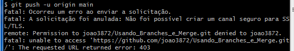
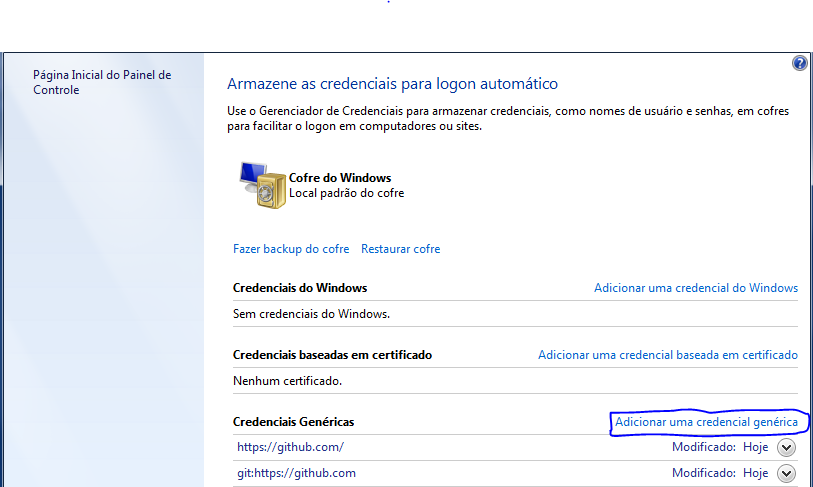
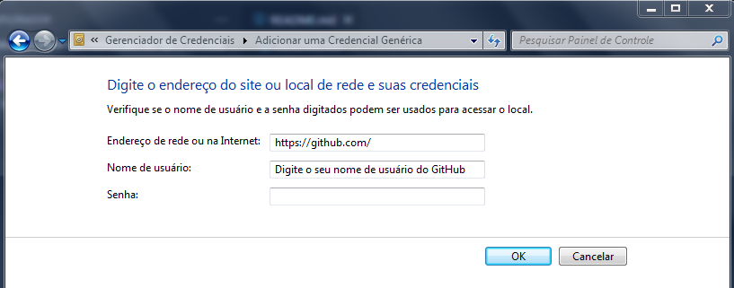

## Solução para Erro de Autenticação entre o Git e GitHub

### Caso o erro for esse:

### Por quê isso acontece ?

* Esse erro apareceu, devido a uma atualização de autenticação entre Git e GitHub que ocorreu em Agosto de 2021, na qual, houve uma mudança em relação ao passo a passo da conexão segura com o GitHub.

* A mudança feita foi: deixar de validar a autenticação com a senha do GitHub do usuário, e passou a validar o Personal Access Token (Token de Acesso Pessoal), como a senha da Autenticação.

### A Solução do erro:

* Aperte a tecla iniciar, caso o sistema da sua máquina seja Windows 7, pesquise no input de pesquisa o seguinte: Gerenciador de Credenciais, no Windows 10 ou superior, basta digitar no input de pesquisa e abrir.

* Em seguida, clique em Adicionar uma credencial genérica.

* Preencha os campos, no primeiro coloque exatamente a url que está na imagem abaixo.

* E na senha, basta colar o seu Token de Acesso Pessoal, com isso clique em OK.

* Pronto problema resolvido !

* Observação: Essa solução para mim, funcionou perfeitamente !!!

* ### Espero ter Ajudado !
